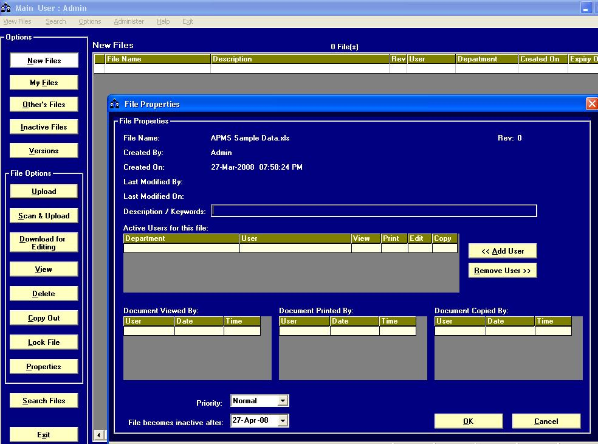



## File/Document Management System

### Description

hi guys

i am back with a new project, must check project!!!

!!! you need Adobe PDF writer to convert scanned files to PDF (works without that too but you need to comment the PDF conversion part of the code in module "modDoc2Pdf")!!!

This time its a File Management System / Doc Management System,

as usual industrial standard solution, but pls note you need Adobe PDF write to convert

scanned files to PDF

You can assign rights to files like View,Print,Copy, Edit etc

Read the help file for more details
 
### More Info
 

             |
---                |---
**Submitted On**   |2008-03-15 13:32:22
**By**             |[Bijo Mathew](https://github.com/Planet-Source-Code/PSCIndex/blob/master/ByAuthor/bijo-mathew.md)
**Level**          |Advanced
**User Rating**    |5.0 (25 globes from 5 users)
**Compatibility**  |VB 6\.0
**Category**       |[Complete Applications](https://github.com/Planet-Source-Code/PSCIndex/blob/master/ByCategory/complete-applications__1-27.md)
**World**          |[Visual Basic](https://github.com/Planet-Source-Code/PSCIndex/blob/master/ByWorld/visual-basic.md)
**Archive File**   |[File\_Docum2107573272008\.zip](https://github.com/Planet-Source-Code/bijo-mathew-file-document-management-system__1-70333/archive/master.zip)

